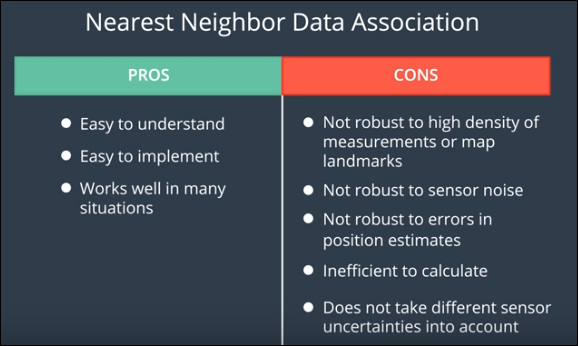

# particle_filters
Code examples from the Particle Filters lesson in Udacity CarND
Also add the exercise problems from Markov Localization chapter

### essense of the particle fliters 
It is an implementation of the Bayes rules just like the kalman filter. 
Checkout the summary picture in the repo which describes how the code realizes the particle filter theory 

### Particle Filter Implementation
##### Initialization
 - First is the initialization step where we take an initial estimate with GPS sensor.
 - e1_pf_cpp_impl.cpp - check out the comments at the top of file to see what is being implemented
##### Prediction
 - Here we will use what we learned in the motion models lesson to predict where the vehicle will be at the next time step, by updating based on yaw rate and velocity, while accounting for Gaussian sensor noise.
 - 
##### Update
 - First we need to look at data associaiton. 
 - Neareast neighbor algorithm pros and cons
 - 
##### Transformations and association
 - The car observes landmarks in car coordinate system, while our particles and landmarks are in map coordinate system. To make this transformation, you use the homogeneous matrix transformation. You already know the math behind it, the code is in map_transformation.cpp file.
 - After doing this, you associate your observations with the landmark positions
 ##### Assigning weights
 - To assign weights we need to get the distances to all observed landmarks and the weight will be proportional to the accurcay. The particles final weight will be calculated as the product of each measurement's Multivariate-Gaussian probability density.
 - multi_gauss folder has the implementation of this calculation. x and y are the observations in map coordinates and and \mu_x and \mu_y are the coordinates of the nearest landmarks.

 - Now to the kidnapped vehicle project to implement all these. 